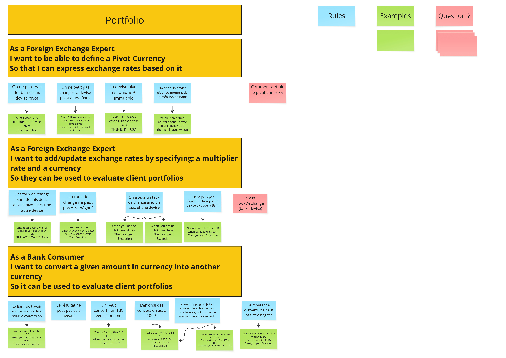

# Example Mapping

## Format de restitution
*(rappel, pour chaque US)*

```markdown
## Titre de l'US (post-it jaunes)
As a Foreign Exchange Expert I want to be able to define a Pivot CurrencySo that I can express exchange rates based on it

> Question (post-it rouge)
Comment définir le pivot currency ?

### Règle Métier (post-it bleu)
On ne peut pas def bank sans devise pivot
On ne peut pas changer la devise pivot d'une Bank
La devise pivot est unique + immuable
On défini la devise pivot au moment de la création de bank

Exemple: (post-it vert)
When créer une banque sans devise pivot, Then Exception

Given EUR est devise pivot, When je veux changer la devise pivot, Then pas possible car pas de méthode

Given EUR & USD, When EUR est devise pivot, THEN EUR != USD

When je créer une nouvelle banque avec devise pivot = EUR, Then new Bank.pivot == EUR

- [ ] 5 USD + 10 EUR = 17 USD
```

```markdown
## Titre de l'US (post-it jaunes)
As a Foreign Exchange Expert I want to add/update exchange rates by specifying: a multiplier rate and a currencySo they can be used to evaluate client portfolios

> Question (post-it rouge)
Class TauxDeChange
(taux, devise)

### Règle Métier (post-it bleu)
 Les taux de change sont définis de la devise pivot vers une autre devise
Un taux de change ne peut pas être négatif
On ajoute un taux de change avec : un taux et une devise
On ne peux pas ajouter un taux pour la devise pivot de la Bank

Vous pouvez également joindre une photo du résultat obtenu en utilisant les post-its.

Exemple: (post-it vert)
Soit une Bank, avec DP de EUR, Si on add USD avec un TdC = 1.15, Alors 10EUR -> USD == 11.5 USD

Given une banque, When veux changer / ajouter taux de change négatif, Then Exception

When you define : TdC sans devise, Then you get :  Exception

When you define : TdC sans taux, Then you get : Exception

Given a Bank.devise = EUR, When Bank.addTdC(EUR), Then you get : Exception
```
```markdown
## Titre de l'US (post-it jaunes)
As a Bank ConsumerI want to convert a given amount in currency into another currencySo it can be used to evaluate client portfolios

> Question (post-it rouge)
Non

### Règle Métier (post-it bleu)
La Bank doit avoir les Currencies dmd pour la conversion
L'arrondi des conversion est à  10^-3
Le résultat ne peut pas être négatif
On peut convertir un TdC vers lui-même
Round tripping : si je fais conversion entre devises, puis inverse, doit trouver le meme montant (%arrondi)
Le montant à convertir ne peut pas être négatif

Exemple: (post-it vert)
Given a Bank without TdC USD, When you try convert(EUR, USD), Then you get : Exception

Given a Bank with a TdC EUR, When you try 2EUR -> EUR, Then it returns = 2

1525.25 EUR => 1754,0375 USD
On arrondi à 1754,04
1754,04 USD => 1523,58 EUR

Given a bank with Pivot = EUR and a TdC USD, When you try : 10EUR => USD = 11.5, Then you get : 11.5USD => EUR = 10

Given a Bank with a TdC USD, When you try Bank.convert(-2, USD), Then you get : Exception

```


## Story 1: Define Pivot Currency

```gherkin
As a Foreign Exchange Expert
I want to be able to define a Pivot Currency
So that I can express exchange rates based on it
```

## Story 2: Add an exchange rate
```gherkin
As a Foreign Exchange Expert
I want to add/update exchange rates by specifying: a multiplier rate and a currency
So they can be used to evaluate client portfolios
```

## Story 3: Convert a Money

```gherkin
As a Bank Consumer
I want to convert a given amount in currency into another currency
So it can be used to evaluate client portfolios
```


