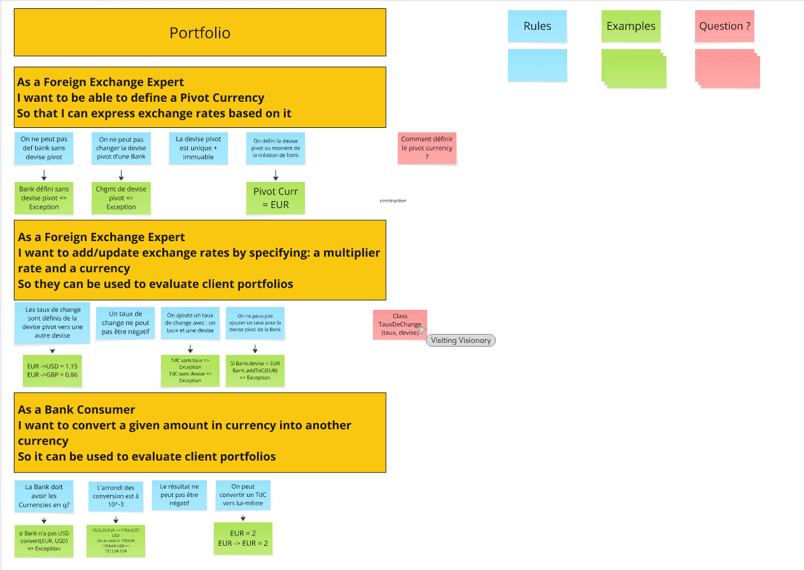

# Example Mapping

## Format de restitution
*(rappel, pour chaque US)*

```markdown
## Titre de l'US (post-it jaunes)
As a Foreign Exchange Expert
I want to be able to define a Pivot Currency
So that I can express exchange rates based on it

> Question (post-it rouge)
Comment définir le pivot currency ?

### Règle Métier (post-it bleu)
On ne peut pas def bank sans devise pivot
On ne peut pas changer la devise pivot d'une Bank
La devise pivot est unique + immuable
On défini la devise pivot au moment de la création de bank

Exemple: (post-it vert)
Bank défini sans devise pivot => Exception
Chgmt de devise pivot => Exception
Pivot Curr = EUR

- [ ] 5 USD + 10 EUR = 17 USD
```

```markdown
## Titre de l'US (post-it jaunes)
As a Foreign Exchange Expert
I want to add/update exchange rates by specifying: a multiplier rate and a currency
So they can be used to evaluate client portfolios

> Question (post-it rouge)
Class TauxDeChange
(taux, devise)

### Règle Métier (post-it bleu)
 Les taux de change sont définis de la devise pivot vers une autre devise
Un taux de change ne peut pas être négatif
On ajoute un taux de change avec : un taux et une devise
On ne peux pas ajouter un taux pour la devise pivot de la Bank

Vous pouvez également joindre une photo du résultat obtenu en utilisant les post-its.

Exemple: (post-it vert)
Si on add EUR ->USD = 1.15
Alors 10EUR -> USD == 11.5 USD
TdC sans taux => Exception
TdC sans devise => Exception
Si Bank.devise = EUR
Bank.addTdC(EUR) => Exception
```
```markdown
## Titre de l'US (post-it jaunes)
As a Bank Consumer
I want to convert a given amount in currency into another currency
So it can be used to evaluate client portfolios

> Question (post-it rouge)
Non

### Règle Métier (post-it bleu)
La Bank doit avoir les Currencies en q?
L'arrondi des conversion est à  10^-3
Le résultat ne peut pas être négatif
On peut convertir un TdC vers lui-même

Exemple: (post-it vert)
si Bank n'a pas USD
convert(EUR, USD) => Exception
1525.25 EUR => 1754,0375 USD
On arrondi à 1754,04
1754,04 USD =>
1523,58 EUR
EUR = 2
EUR -> EUR = 2
```


## Story 1: Define Pivot Currency

```gherkin
As a Foreign Exchange Expert
I want to be able to define a Pivot Currency
So that I can express exchange rates based on it
```

## Story 2: Add an exchange rate
```gherkin
As a Foreign Exchange Expert
I want to add/update exchange rates by specifying: a multiplier rate and a currency
So they can be used to evaluate client portfolios
```

## Story 3: Convert a Money

```gherkin
As a Bank Consumer
I want to convert a given amount in currency into another currency
So it can be used to evaluate client portfolios
```


